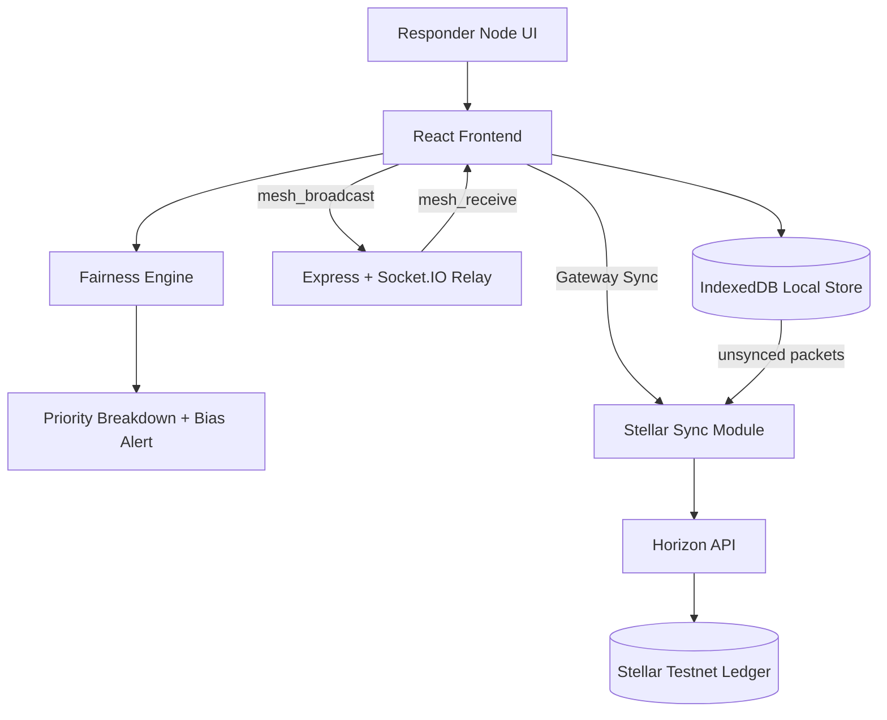
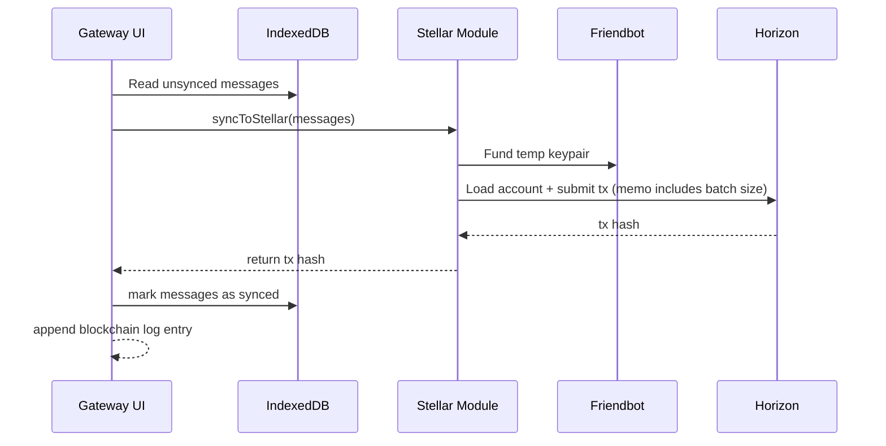

# DisasterNet

[](#license)
[](./frontend/package.json)
[](#development-status)
[](#development-status)
[](#development-status)
[](https://github.com/abhi8667/disasterNet/stargazers)
[](https://github.com/abhi8667/disasterNet/network/members)
[](https://github.com/abhi8667/disasterNet/issues)
[](https://github.com/abhi8667/disasterNet/pulls)
[](./README.md)

Offline-first disaster response coordination with mesh relay, local durability, fairness-based prioritization, and blockchain sync proofing.

DisasterNet is a full-stack emergency communication prototype built for degraded-network scenarios where internet access is intermittent or unavailable. Nodes relay SOS packets across a mesh-style broadcast channel (Socket.IO), persist packets locally in IndexedDB, and synchronize unsynced events to the Stellar testnet when a gateway node regains internet access.

The project combines operational UX and algorithmic transparency: each incident receives a priority score based on urgency, affected population, accessibility difficulty, and wait-time fairness offset. The interface exposes this scoring breakdown and bias alerting to support accountable triage decisions under pressure.

---

## Table of Contents

- [Overview](#overview)
- [Project at a Glance](#project-at-a-glance)
- [Key Features](#key-features)
- [Architecture](#architecture)
- [Tech Stack](#tech-stack)
- [Repository Structure](#repository-structure)
- [Getting Started](#getting-started)
- [Usage](#usage)
- [Socket Protocol](#socket-protocol)
- [Fairness Scoring Model](#fairness-scoring-model)
- [Blockchain Sync Flow](#blockchain-sync-flow)
- [Development Status](#development-status)
- [Contributing](#contributing)
- [Roadmap](#roadmap)
- [Hiring Signal](#hiring-signal)
- [License](#license)

---

## Overview

### Problem Statement
Traditional emergency tooling often assumes stable connectivity, centralized infrastructure, and immediate backend reachability. During real disasters, those assumptions fail first.

### Why this project exists
DisasterNet explores a resilient alternative: capture and propagate high-priority SOS data locally-first, continue operations in partial network outages, and reconcile records to a public ledger when connectivity returns.

### Intended users
- Disaster-response teams and field operators
- Civic-tech researchers and hackathon builders
- Developers studying offline-first and eventual-consistency patterns

### Real-world applications
- Emergency message relay in connectivity-constrained regions
- Community response coordination during infrastructure outages
- Transparent triage scoring audits for humanitarian workflows

## Project at a Glance

| Item | Details |
|---|---|
| Project Type | Full-stack application (frontend + backend service) |
| Repository | https://github.com/abhi8667/disasterNet |
| Frontend | React 19 + Vite + Tailwind + Framer Motion + Recharts |
| Backend | Express + Socket.IO relay server |
| Data Layer | IndexedDB (`idb`) for offline durability |
| Sync Layer | Stellar testnet transaction anchoring |
| Primary Audience | Developers, researchers, students, response-tech builders |

## Key Features

### Core Features
- Mesh-style SOS packet broadcast between connected nodes
- Offline-capable local persistence using IndexedDB
- Internet/gateway detection with manual offline simulation toggle
- Tactical map view for incident visualization and packet selection

### Advanced Features
- Priority scoring engine with explainable factor breakdown
- Wait-time fairness boost to reduce long-tail neglect
- Gateway-triggered Stellar sync for unsynced packet batches
- Immutable-looking sync log with transaction hash timeline

### Developer Experience
- Simple two-service local setup
- Clear Socket event model (`mesh_broadcast`, `mesh_receive`)
- Typed packet schema for consistent client behavior
- One-click hard reset to clear local demo state

## Architecture



## Tech Stack

| Layer | Technologies |
|---|---|
| Frontend | React, TypeScript syntax, Vite, Tailwind CSS, Framer Motion, Recharts |
| Networking | Socket.IO client/server |
| Backend | Node.js, Express, CORS |
| Storage | IndexedDB via `idb` |
| Blockchain | `@stellar/stellar-sdk`, Horizon testnet, Friendbot funding |
| Tooling | npm, ESLint (frontend script), Vite build pipeline |

## Repository Structure

```text
disasterNet/
├── backend/
│   ├── server.js
│   └── package.json
└── frontend/
    ├── src/
    │   ├── App.tsx
    │   ├── context/MeshContext.tsx
    │   ├── ai/fairnessEngine.ts
    │   ├── blockchain.ts
    │   ├── db.ts
    │   └── types.ts
    ├── vite.config.ts
    └── package.json
```

## Getting Started

### Prerequisites
- Node.js 18+
- npm 9+

### 1) Install dependencies

```bash
cd /tmp/workspace/abhi8667/disasterNet/backend && npm install
cd /tmp/workspace/abhi8667/disasterNet/frontend && npm install
```

### 2) Start backend relay server

```bash
cd /tmp/workspace/abhi8667/disasterNet/backend
node server.js
```

Server runs on `http://localhost:3001`.

### 3) Start frontend

```bash
cd /tmp/workspace/abhi8667/disasterNet/frontend
npm run dev
```

Open the Vite URL printed in your terminal.

## Usage

1. Launch multiple browser tabs or devices on the same network.
2. Send SOS payloads with severity values.
3. Observe packet propagation and tactical markers.
4. Select markers to inspect AI priority breakdown.
5. Toggle offline mode to simulate degraded connectivity.
6. When online gateway is available, trigger ledger sync.

> [!TIP]
> To simulate multiple devices locally, open the app in multiple tabs and keep the backend server running.

## Socket Protocol

| Event | Direction | Payload | Purpose |
|---|---|---|---|
| `mesh_broadcast` | Client → Server | `SOSPacket` | Send new or relayed packet |
| `mesh_receive` | Server → Other clients | `SOSPacket` | Fan out packet to peers |

## Fairness Scoring Model

Current score factors (capped to 10):

- **Medical urgency** (0–5)
- **People affected** (0–2)
- **Location accessibility** (0–1)
- **Wait-time fairness offset** (0–2 after 30 min)

Bias alert currently flags packets with wait-time above 60 minutes for triage review.

## Blockchain Sync Flow



## Development Status

> [!IMPORTANT]
> Current repository scripts are partially configured:
> - `backend/npm test` intentionally exits with “no test specified”.
> - `frontend/npm run lint` fails because ESLint binary/config is not present.
> - `frontend/npm run build` fails because a TypeScript project config (`tsconfig.json`) is not present.

These are known setup gaps and good first contributions.

## Contributing

Contributions are welcome, especially in reliability, testing, and production hardening.

### Suggested contribution workflow

- [ ] Open an issue describing the bug/feature proposal
- [ ] Fork and create a focused branch
- [ ] Keep PRs small and scoped
- [ ] Include reproduction steps and validation notes
- [ ] Update documentation for behavioral changes

### High-impact contribution areas
- Automated tests for mesh propagation and sync logic
- Security hardening for CORS and payload validation
- Stable identity model instead of per-session node IDs
- Production-grade retry/backoff and conflict handling
- CI pipeline for lint/build/test checks

## Roadmap

- [ ] Add robust backend input validation and schema enforcement
- [ ] Add deterministic packet dedupe + TTL controls
- [ ] Add role-based gateway authorization
- [ ] Add observability (structured logs, metrics, tracing)
- [ ] Replace demo sync memo with packet-batch cryptographic hash
- [ ] Add deployment manifests and environment config docs

## Hiring Signal

This repository demonstrates practical capability in:

- Distributed systems thinking (offline-first + eventual sync)
- Real-time systems design (Socket.IO relay patterns)
- Data durability on edge clients (IndexedDB strategy)
- Explainable triage logic with fairness-aware weighting
- End-to-end product implementation from backend to UX

## License

No top-level repository license file is currently present. Add a `LICENSE` file to define reuse terms explicitly.
